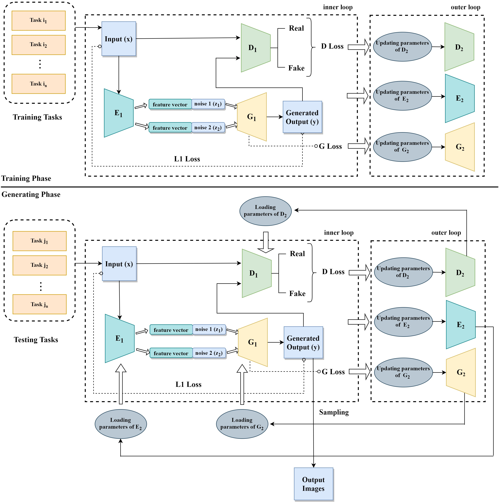
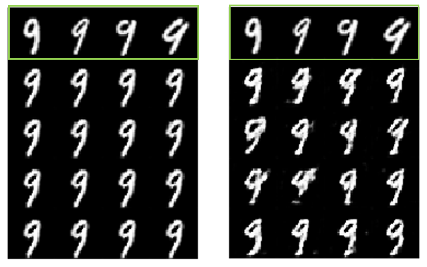
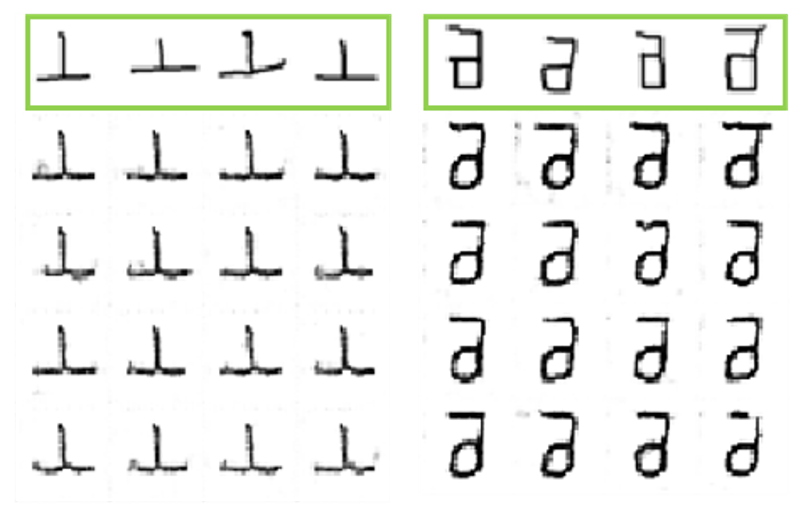
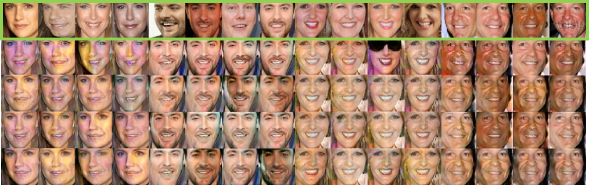
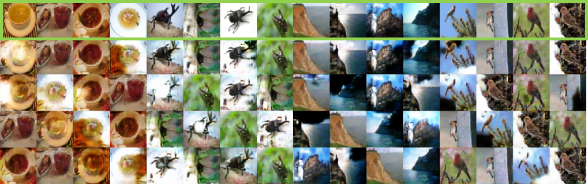

# FAML
The official Pytorch implementation of IEEE Transactions on Multimedia 2021 [Fast Adaptive Meta-Learning for Few-Shot Image Generation](https://ieeexplore.ieee.org/abstract/document/9424414/) (FAML).

If this code is useful for you, please consider citing the paper as following detail:
```
@article{phaphuangwittayakul2021fast,
  title={Fast Adaptive Meta-Learning for Few-shot Image Generation},
  author={Phaphuangwittayakul, Aniwat and Guo, Yi and Ying, Fangli},
  journal={IEEE Transactions on Multimedia},
  year={2021},
  publisher={IEEE}
}
```



<em>Fast Adaptive Meta-Learning (FAML) based on GAN and the encoder network is proposed in this study for few-shot image generation. The model can generate new realistic images from unseen target classes with few samples of data.</em>

## Installation

    $ git clone https://github.com/phaphuang/FAML.git
    $ cd FAML
    $ pip install -r requirements.txt

## Preparing datasets
The default folder of datasets are placed under `data`.

**MNIST** and **Omniglot** can be automatically downloaded by running the training scripts.

#### VggFace and miniImageNet datasets
VggFace
1. Downloaded the modified [32x32 VggFace](https://bit.ly/3aDmEcH) and [64x64 VggFace](https://bit.ly/3dP9RpF) datasets and their [training](https://bit.ly/3vhiyPh) and [validation](https://bit.ly/3v9S8Pw) tasks.
2. Place all downloaded files in `data/vgg/`

miniImageNet
1. Downloaded the modified [32x32 miniImageNet](https://bit.ly/3nhj3Gq) and [64x64 miniImageNet](https://bit.ly/3evZOER) datasets and their [training](https://bit.ly/2QU3FUb) and [validation](https://bit.ly/3gHxOAX) tasks.

2. Place all downloaded files in `data/miniimagenet/`

## Training the model
```
$ python train.py --dataset Mnist --height 32 --length 32
```
View all options for different training parameters:
```
$ python train.py --help
```
## Generated Outputs
**MNIST**

**Omniglot**

**VggFace**

**miniImageNet**


## Acknowledgement
Some of the codes are built upon [FIGR](https://github.com/LuEE-C/FIGR). Thanks them for their great work!
<em>FAML</em> is freely available for non-commercial use. Don't hesitate to drop e-mail if you have any problem.